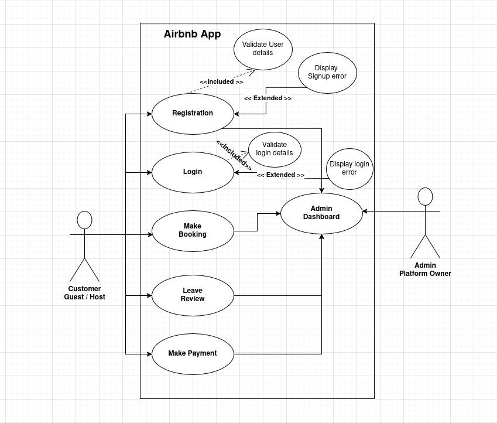

# Requirement Analysis
outlines the system requirements of an Airbnb-like application, detailing the necessary features, functionalities, and performance standards. It includes descriptions of user roles such as guests, hosts, and administrators, and specifies both functional requirements and non-functional requirements

## What is Requirement Analysis?
Requirement Analysis is a critical phase in the software development lifecycle (SDLC) where the project team gathers, analyzes, and defines the requirements of the software product to be developed. This process ensures that all stakeholders have a clear and mutual understanding of what the system should do and how it should perform.

## Why is Requirement Analysis Important?
- **Clarity and Understanding:** It helps in understanding what the stakeholders expect from the software, reducing ambiguity.

- **Scope Definition:** Clearly defines the scope of the project, which helps in preventing scope creep.

- **Basis for Design a**nd Development: Provides a solid foundation for designing and developing the system.

- **Cost and Time Esti**mation: Facilitates accurate estimation of project cost, resources, and time.

- **Quality Assurance:** Ensures that the final product meets the specified requirements, leading to higher customer satisfaction.

## Key Activities in Requirement Analysis.
### 1. Requirement Gathering
  - Engage with stakeholders to collect initial requirements.
  - Use various techniques like interviews, surveys, and workshops.
### 2. Requirement Elicitation
  - Refine and elaborate on the gathered requirements.
  - Use techniques like brainstorming, focus groups, and prototyping.
### 3. Requirement Documentation
  - Document the requirements in a detailed and structured format.
  - Use requirement specification documents, user stories, and use cases.
### 4. Requirement Analysis and Modeling
  - Analyze and prioritize the requirements.
  - Create models to visualize and understand the requirements.
### 5. Requirement Validation
  - Review and validate the requirements with stakeholders.
  - Define acceptance criteria and ensure traceability.

## Types of Requirements
### Functional Requirements ⚙️
- Definition: Describe what the system should do.
Examples: User authentication, property search, booking system, user registration.

### Key Functional Requirements:

- **Search Properties:** Users should be able to search for properties based on various criteria such as location, price, and availability.
- **User Registration:** New users should be able to create an account with personal details and login credentials.
- **Property Listings:** Display properties with essential details and images.
- **Booking System:** Users should be able to book properties, view booking details, and manage their bookings.
- User Authentication: Secure login and registration process for users.

### Non-functional Requirements 🛡️
- **Definition:** Describe how the system should perform.
Examples: Performance, security, scalability, usability, reliability.

### Key Non-functional Requirements:

- **Performance:** The system should load pages within 2 seconds and handle up to 1000 concurrent users.
- **Security:** Ensure data encryption, secure login, and protect against common vulnerabilities.
- **Scalability:** The system should be able to scale horizontally to handle increased traffic.
- **Usability:** The application should have an intuitive UI/UX, making it easy for users to navigate and perform tasks.
- **Reliability:** The system should have an uptime of 99.9% and recover quickly from any failures.

## Use Case Diagrams
Use case diagrams show how different users (actors) interact with the system to achieve specific goals (use cases).

- **Benefits of Use Case Diagrams:**

  - Provide a clear visual representation of system functionalities.
  - Help in identifying and organizing system requirements.
  - Facilitate communication among stakeholders and development team.

## Acceptance Criteria
- **What is Acceptance Criteria?**
  - Acceptance criteria are conditions that a feature must meet to be accepted by the stakeholders.

- **Benefits of Acceptance Criteria:**

  - Ensure all parties have a clear understanding of feature requirements.
  - Provide a basis for testing and validation.
  - Help in maintaining quality and meeting user expectations.